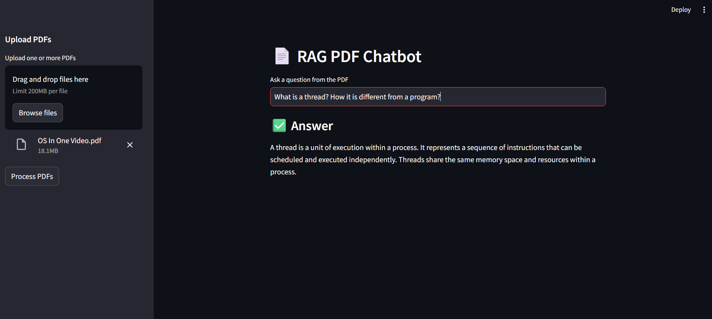

# DocuMind 📄

DocuMind is a **Retrieval-Augmented Generation (RAG) PDF chatbot** that allows users to upload PDFs and ask questions strictly based on their content. It uses FAISS for semantic retrieval and HuggingFace models for local inference.

## Screenshot
Below is a sample screenshot showing DocuMind in action:




## Features
- Upload multiple PDFs
- Context-aware question answering (RAG)
- FAISS vector store
- HuggingFace embeddings & LLM
- Fully local (no API keys required)

## Tech Stack
- Python
- Streamlit
- LangChain
- FAISS
- HuggingFace
- PyPDF2

## Run Locally
```bash
pip install -r requirements.txt
streamlit run app.py
